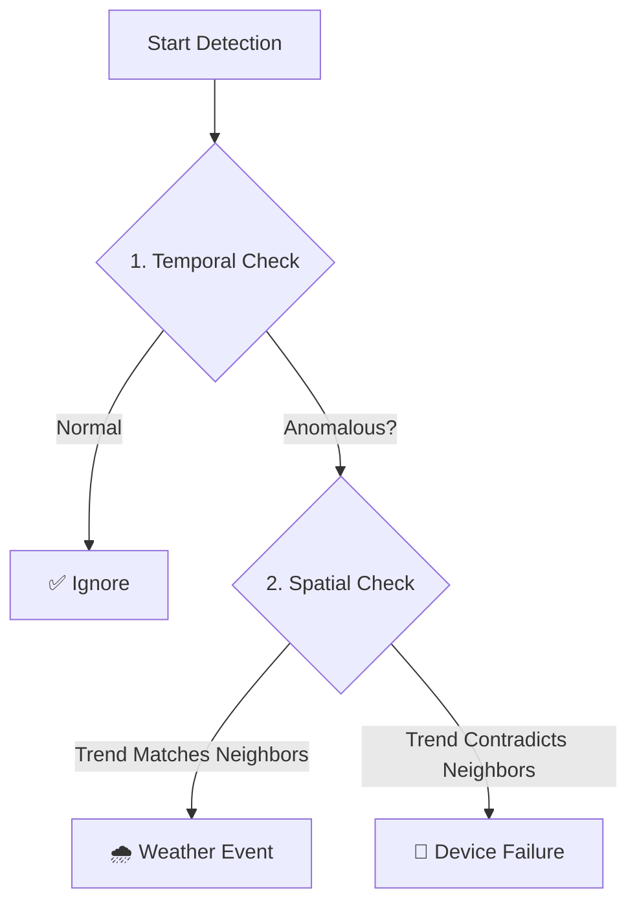

# 🌦️ Real-Time Weather Anomaly Detection System

Real-time monitoring and anomaly detection for 14 meteorological stations from the National Observatory of Athens (NOA).

> **Note**: This system now uses a **Dual-Verification Strategy** (Temporal + Spatial) to distinguish between device failures and extreme weather events.

---

## 🧠 Core Logic: Time-Space Dual Verification

This system uses a two-step verification process to minimize false alarms.



### Step 1: Temporal Detection ("Self-Check")
*   **Question**: "Is the station's current value consistent with its own history?"
*   **Method**: **ARIMA** (AutoRegressive Integrated Moving Average) predicts the next value based on the past 6 hours.
*   **Result**: If the actual value deviates significantly from the prediction, it is flagged as a **Suspect**.

### Step 2: Spatial Verification ("Neighbor-Check")
*   **Question**: "Are neighboring stations behaving similarly?"
*   **Method**: **Pearson Correlation** is calculated between the suspect station and its neighbors (within 100km).
*   **Result**:
    *   **High Correlation (>0.6)**: Neighbors are doing the same thing (e.g., all dropping temp). -> **Ignored as Weather**.
    *   **Low Correlation (<0.3)**: Only this station is acting up. -> **Confirmed as Device Failure**.

---

## 🚀 Usage Guide

### 1. Command Input

**Basic Syntax**:
```bash
python anomaly_detector.py --end "TIMESTAMP" --window HOURS --temporal-method METHOD --spatial-verify
```

**Example Command**:
```bash
python anomaly_detector.py \
  --end "2025-11-22 17:00:00" \
  --window 6 \
  --temporal-method arima \
  --spatial-verify
```

| Argument | Description | Recommended Value |
| :--- | :--- | :--- |
| `--end` | The target timestamp to detect | `"NOW"` or specific time (e.g., `"2025-11-22 17:00:00"`) |
| `--window` | Length of historical data to analyze (hours) | `6` |
| `--temporal-method` | Algorithm for Step 1 (Temporal) | `arima` (best) or `3sigma` |
| `--spatial-verify` | **Enable Step 2 (Spatial Verification)** | Always include this flag |
| `--save` | Save report to JSON file | Optional |

---

### 2. Output Explanation

The system prints a human-readable report to the console.

#### A. Summary Section
Quickly see if any *real* action is needed.

```text
Total Stations: 14
Anomalous Stations: 1
Normal Stations: 13

Anomaly Breakdown:
  🔴 Device Failures: 0      <-- CHECK THIS (Real Hardware Issues)
  🌧️ Weather Events: 1       <-- IGNORE THIS (Just Weather)
  ⚠️ Suspected:      0       <-- MANUAL CHECK (Uncertain Cases)
```

#### B. Detailed Report Section
Shows exactly *why* a station was flagged.

```text
[ STATION: uth_volos (Volos - University) ]
  ⚠️  Temperature Anomaly:
      Method: arima
      Expected: 12.5°C | Actual: 10.1°C
      • 2025-11-22 17:00:00: 10.10°C -> 🌧️ Extreme Weather / Env Change
        └─ Diag: Trend Consistent (Corr: 0.85, 3 neighbors)
```

*   **Method**: Which temporal algorithm flagged it (`arima`).
*   **Expected/Actual**: The deviation magnitude.
*   **Arrow (`->`)**: The final classification after Spatial Verification.
    *   `🌧️ Extreme Weather`: Because `Trend Consistent` (Correlation 0.85 > 0.6).
    *   `🔴 Device Failure`: If it had said `Trend Inconsistent` (Correlation < 0.3).

---

## 📁 Project Structure

```text
stream_detection/
├── anomaly_detector.py            # [CORE] Main detection engine (Temporal + Spatial)
├── streaming_collector_sqlite.py  # [CORE] Real-time data collector
├── weather_stream.db              # [DATA] SQLite database storing all history
├── manage_collector.sh            # [OPS] Service management script (start/stop)
│
├── view_data.py                   # [TOOL] Query and export DB data
├── spatial_network_map.html       # [VISUALIZATION] Station network map
└── README.md                      # Documentation
```

---

## 🔍 Troubleshooting

**Q: Why does MAD report so many anomalies?**
A: MAD is very sensitive to small deviations in stable weather. Use **ARIMA** for better trend handling.

**Q: What does "Trend Skipped: no_neighbors" mean?**
A: The station is geographically isolated (no neighbors within 100km). Spatial verification cannot be performed, so the result relies solely on temporal detection.

**Q: How to check neighbors' data manually?**
A: The console output automatically prints a data table for the target station and its neighbors when an anomaly is detected.
